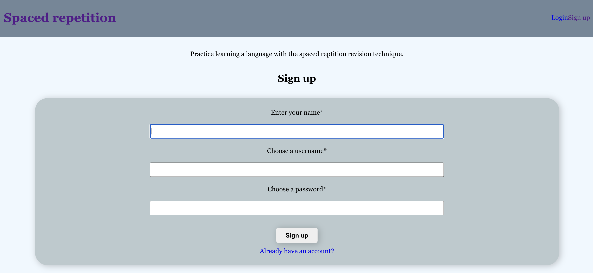
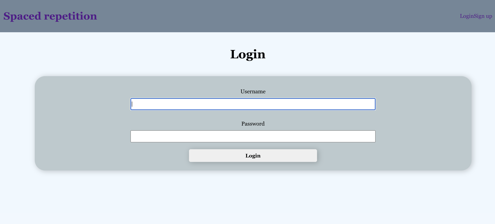
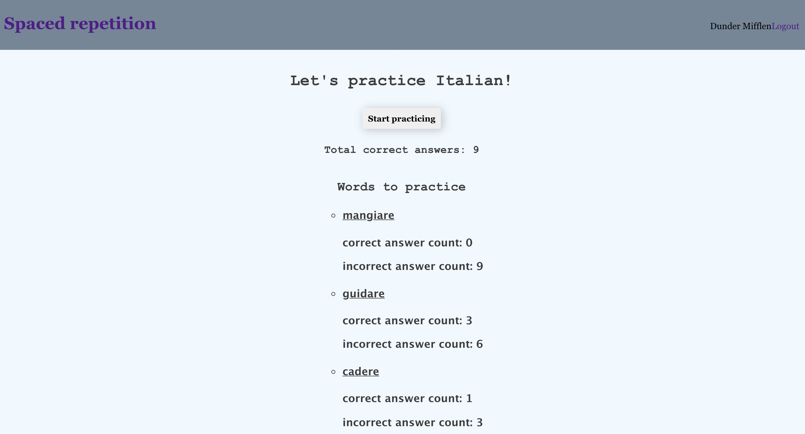
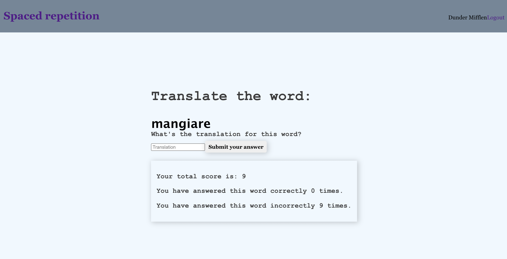
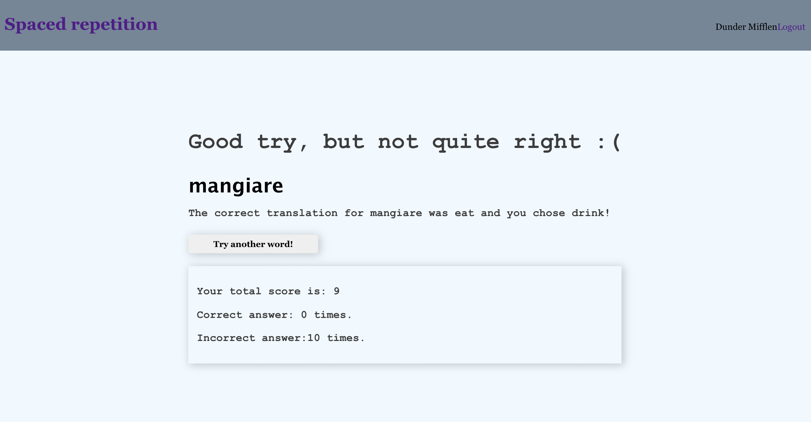

# Spaced Repetition Capstone

Live application: [https://spaced-client-psi.vercel.app/](https://spaced-client-psi.vercel.app/)

API Repo: [https://github.com/Nishat322/spaced-api](https://github.com/Nishat322/spaced-api)

## User Story

Spaced-Repetition utilizes spaced repetition as a technnique to facilitate language learning. The first page allows users to login or register an account. Once logged in a user will see a list of words to be practiced. When a user selects 'Start Practicing' they are prompted with a word to translate. Submitting an answer leads the user to a feedback page where they can check whether thier answer was correct or incorrect. 

Dummy Account Information 
- USERNAME: mifflen123
- PASSWORD: Happy123@

### Landing Page /Login

### Login Page

### Dashboard

### Translate the Word

### Feedback Page

## Tech Stack

## Frontend
- ReactJS
- React Router/ Context
- HTML
- CSS
- Webpack
- Cypress testing
- Deployed 

## Backend
- RESTful API
- Node & Express
- PostgresSQL/ Knex
- Supertest/ Mocha & Chai
- Deployed Heroku

